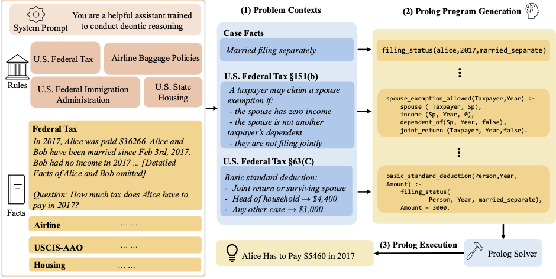

# DeonticBench

**DeonticBench** is a benchmark for evaluating LLMs on deontic reasoning over real-world legal and regulatory statutes. Given case facts and statutory rules, models must derive legally correct answers — either by generating executable Prolog programs (few-shot or zero-shot) or by answering directly in natural language. It spans five domains (U.S. federal tax, airline baggage policies, state housing law, and USCIS immigration appeals) and includes verified reference Prolog programs for each case.

<p align="center">
  
  <br>
  <em>Walkthrough of a DeonticBench instance in the symbolic setting. (1) Given the full problem context, the model performs deontic reasoning to identify and apply the relevant rules. (2) The LLM translates the problem into Prolog code. (3) The generated Prolog is executed by SWI-Prolog solver. The illustrated example is a 2017 tax-liability case.</em>
</p>

## 📊 Dataset

**Dataset**: Available on [Hugging Face](https://huggingface.co/datasets/gydou/DeonticBench)

Each domain has three splits: **smoke** (5 cases for quick sanity checks), **hard** (curated test subset with verified reference Prolog programs), and **whole** (full dataset). The hard set is always a subset of whole.

| Domain | Description | Label | Smoke | Hard | Whole |
|---|---|---|---:|---:|---:|
| **SARA Numeric** | U.S. federal income tax (§1, §2, §63, §151, §152, ...) | Integer (tax owed, $) | 5 | 35 | 100 |
| **SARA Binary** | Entailment/contradiction over individual tax statute clauses | `0` / `1` | 5 | 30 | 276 |
| **Airline** | Airline baggage fee policies | Integer (total cost, $) | 5 | 80 | 300 |
| **Housing** | U.S. state housing and eviction law (50 states) | `"yes"` / `"no"` | 5 | 78 | 5314 |
| **USCIS-AAO** | USCIS Administrative Appeals Office immigration cases | `"Accepted"` / `"Dismissed"` | 5 | 28 | 242 |

Each entry contains a natural language `question`, a ground-truth `label`, and a `reference_prolog` program encoding the applicable rules and case facts. A `statutes` field carries the relevant legal text — shared across all cases for SARA and Airline, case-specific for Housing and USCIS.

### SARA Numeric / SARA Binary / Airline

```
statutes      : shared statutory text (IRC §§1,2,63,… for SARA; baggage policy for Airline)
text          : case narrative  ("Alice and Harold got married on Sep 3rd, 1992…")
question      : "How much tax does Alice have to pay in 2017?"
label         : 68844              ← integer $ for SARA Numeric / Airline; 0/1 for SARA Binary
reference_prolog : verified Prolog encoding rules + facts
```

### Housing

```
statutes      : case-specific statute excerpts  ("MICH. COMP. LAWS § 600.5704…")
state         : "Michigan"
question      : "Are eviction cases first heard in municipal court?"
label         : "yes"
reference_prolog : verified Prolog encoding rules + facts
```

### USCIS-AAO

```
case_number   : AAO case number  ("APR112023_01B5203")
statutes      : case-specific applicable law  ("Under Matter of Dhanasar…")
text          : case narrative  ("The petitioner is a physician-researcher…")
question      : "Should this case be accepted or dismissed?"
label         : "Accepted"
reference_prolog : verified Prolog encoding rules + facts
```

---

## Running Experiments

DeonticBench ships with an inference pipeline that reproduces our results using three API providers: **OpenAI**, **OpenRouter**, and **Together AI**. All three scripts are in `experiments/` and share the same interface.

### 1. Install dependencies

```bash
conda create -n deonticbench python=3.10 -y
conda activate deonticbench
pip install -r requirements.txt
```

SWI-Prolog must also be installed and available as `swipl` on your `PATH`. See the [official website](https://www.swi-prolog.org/) for installation instructions.

### 2. Choose a domain and split

| `DOMAIN` value | Dataset |
|---|---|
| `sara_numeric` | SARA Numeric (tax, 35 hard cases) |
| `sara_binary` | SARA Binary (entailment, 30 hard cases) |
| `airline` | Airline baggage fees (80 hard cases) |
| `housing` | Housing/eviction law (78 hard cases) |
| `uscis` | USCIS-AAO immigration appeals (28 hard cases) |

Use `SPLIT` to select the evaluation split:

| `SPLIT` value | Description |
|---|---|
| `smoke` | 5 cases per domain — fast sanity check |
| `hard` | Curated subset with verified reference Prolog (default) |
| `whole` | Full dataset |

### 3. Solving modes

The pipeline supports three ways to evaluate a model on each case:

| Mode (`MODES` value) | CLI task | Description |
|---|---|---|
| `few-shot` | `prolog` | LLM is given the statute text and 1–2 worked Prolog examples, then writes Prolog for the new case |
| `zero-shot` | `standalone` | LLM writes Prolog with only the statute text — no examples |
| `direct` | `direct` | LLM answers the question in natural language (no Prolog) |

Pass one or more modes as a space- or comma-separated list (default: all three):
```bash
MODES="few-shot"                  # single mode
MODES="few-shot zero-shot"        # two modes, space-separated
MODES="few-shot,zero-shot,direct" # all three, comma-separated
```

### 4. Set your API key

Export your API key before running (e.g., add to `~/.bashrc` or `~/.zshrc`):

```bash
export OPENAI_API_KEY=...        # for run_openai.sh
export OPENROUTER_API_KEY=...    # for run_openrouter.sh
export TOGETHER_API_KEY=...      # for run_together.sh
```

Alternatively, pass the key inline on the command line, e.g. `OPENAI_API_KEY=... bash experiments/run_openai.sh`.

### 5. Run inference

Specify `MODELS` to choose which model(s) to evaluate, and `MODES` to select which solving mode(s) to run (see section 3 for mode descriptions).

#### Models by provider

**OpenAI** (`experiments/run_openai.sh`) — pass any model name accepted by the OpenAI API:

| Model | Type |
|---|---|
| `o3-2025-04-16` | Reasoning |
| `gpt-4.1-2025-04-14` | Standard |
| `gpt-5-2025-08-07` | Reasoning |
| `gpt-5.1-2025-11-13` | Reasoning |
| `gpt-5.2-2025-12-11` | Reasoning |
| `gpt-5.2-codex` | Reasoning |

Reasoning models automatically receive the `reasoning_effort` parameter and have `temperature` suppressed. Override effort with `REASONING_EFFORT=low|medium|high` (default: `medium`).

**OpenRouter** (`experiments/run_openrouter.sh`) — use the `owner/model` format from [openrouter.ai/models](https://openrouter.ai/models):

| Model | Type |
|---|---|
| `anthropic/claude-opus-4` | Standard |
| `anthropic/claude-sonnet-4.5` | Standard |
| `google/gemini-2.5-flash` | Standard |
| `moonshotai/kimi-k2-0905` | Standard |
| `moonshotai/kimi-k2-thinking` | Reasoning |
| `openai/gpt-5.2-codex` | Reasoning |

> **Note**: OpenRouter has a known `n > 1` bug. The pipeline automatically works around this by looping `n=1` calls.

**Together AI** (`experiments/run_together.sh`) — use the model ID from [api.together.ai/models](https://api.together.ai/models):

| Model | Type |
|---|---|
| `Qwen/Qwen3-235B-A22B-Instruct-2507-tput` | Standard |
| `Qwen/Qwen3-235B-A22B-Thinking-2507` | Reasoning |
| `Qwen/Qwen3-Coder-480B-A35B-Instruct-FP8` | Standard |
| `Qwen/Qwen3-Coder-Next-FP8` | Standard |

Thinking/reasoning models automatically receive `reasoning_effort`. Use `REASONING_EFFORT=none` for no thiniking effort.

> **Note**: Together AI does not support `n > 1`. The pipeline automatically loops `n=1` calls.

#### Configuring models: `model_config.yaml`

`model_config.yaml` at the repo root is the single place to register new models and tune their API parameters. It has two sections:

```yaml
# Models that receive `reasoning_effort` and have temperature suppressed.
# Add any model that accepts this parameter here.
reasoning_models:
  - o3-2025-04-16
  - gpt-5.1-2025-11-13
  - moonshotai/kimi-k2-thinking
  # ... add more as needed

# Per-model API parameter overrides.
# Supported keys: temperature, top_p, max_tokens, top_k, min_p, repetition_penalty
# Omit a key to use the provider/script default.
model_params:
  Qwen/Qwen3-235B-A22B-Instruct-2507-tput:
    temperature: 0.7
    top_p: 0.8
    max_tokens: 32768
  moonshotai/kimi-k2-thinking:
    temperature: 0.6
    top_p: 0.95
```

**When to add a model to `reasoning_models`**: if calling the model with a `reasoning_effort` field (e.g. `"reasoning_effort": "medium"`) is valid for that API. Standard chat models will receive an API error if this field is sent unexpectedly.

**When to add a model to `model_params`**: if the model requires non-default sampling parameters — for example, Qwen3 instruct models recommend `temperature=0.7, top_p=0.8`, while thinking models use `temperature=0.6, top_p=0.95`.

**Example — adding a new thinking model on OpenRouter**:
```yaml
reasoning_models:
  - provider/my-new-thinking-model

model_params:
  provider/my-new-thinking-model:
    temperature: 0.6
    top_p: 0.95
    max_tokens: 32768
```

No code changes are needed — the pipeline reads `model_config.yaml` at runtime.

#### Quick start

```bash
# OpenAI — o3, all modes, sara_numeric
DOMAINS=sara_numeric MODES="few-shot zero-shot direct" bash experiments/run_openai.sh

# OpenRouter — Claude + Gemini, all modes, airline
DOMAINS=airline MODES="few-shot zero-shot direct" bash experiments/run_openrouter.sh

# Together AI — Qwen3, all modes, uscis
DOMAINS=uscis MODES="few-shot zero-shot direct" bash experiments/run_together.sh
```

### 6. Common options

All three scripts accept the same environment variables:

| Variable | Default | Description |
|---|---|---|
| `DOMAIN` | `sara_numeric` | Dataset to run (see table above) |
| `SPLIT` | `hard` | JSON split to use: `smoke` (5 cases), `hard`, or `whole` |
| `MODELS` | Provider-specific default | Space-separated model name(s) |
| `MODES` | `few-shot zero-shot direct` | Subset of modes to run (comma or space separated) |
| `NUM_GENERATIONS` | `2` | Independent generations per case |
| `NUM_EXEMPLARS` | `2` (sara/airline), `1` (housing/uscis) | Few-shot exemplars |
| `OUTPUT_DIR` | `outputs/` | Root directory for all outputs |
| `SWIPL_TIMEOUT` | `10` | Per-case SWI-Prolog timeout in seconds |
| `REASONING_EFFORT` | `medium` | Reasoning effort for thinking models: `low`, `medium`, `high` (ignored for non-thinking models) |
| `PYTHON` | `python` | Python executable |

**Examples**

Run multiple modes together (space- or comma-separated):
```bash
DOMAIN=sara_numeric MODES="few-shot zero-shot" bash experiments/run_openai.sh
DOMAIN=sara_numeric MODES="few-shot,zero-shot,direct" bash experiments/run_openai.sh
```

Run only few-shot mode on airline with two specific models:
```bash
DOMAIN=airline \
MODES=few-shot \
MODELS="o3-2025-04-16 gpt-4.1-2025-04-14" \
bash experiments/run_openai.sh
```

`SPLIT` defaults to `hard`. To evaluate both splits, run the script twice — each run gets its own timestamped output directory so outputs won't collide:
```bash
# Hard split (default)
DOMAIN=airline MODES=few-shot MODELS="o3-2025-04-16 gpt-4.1-2025-04-14" \
bash experiments/run_openai.sh

# Whole split
DOMAIN=airline SPLIT=whole MODES=few-shot MODELS="o3-2025-04-16 gpt-4.1-2025-04-14" \
bash experiments/run_openai.sh
```

`REASONING_EFFORT` applies to all models in a run. To mix reasoning efforts across models, run them separately:
```bash
# o3 with high reasoning effort
DOMAIN=airline MODES=few-shot MODELS="o3-2025-04-16" REASONING_EFFORT=high \
bash experiments/run_openai.sh

# gpt-4.1 (non-reasoning model; REASONING_EFFORT is ignored)
DOMAIN=airline MODES=few-shot MODELS="gpt-4.1-2025-04-14" \
bash experiments/run_openai.sh
```

Run housing with a Together AI open-source model, direct mode only:
```bash
DOMAIN=housing \
MODES=direct \
MODELS="Qwen/Qwen3-235B-A22B-Instruct-2507-tput" \
bash experiments/run_together.sh
```

### 7. Output layout

Outputs use a stable, timestampless layout so multiple runs accumulate in the same directory and evaluation scripts can use fixed paths:

```
outputs/
└── <domain>/
    ├── few_shot/<provider>/<model>/prolog.json            # Raw LLM generations
    ├── zero_shot/<provider>/<model>/standalone_prolog.json
    ├── direct/<provider>/<model>/source.json
    ├── processed_prolog/
    │   ├── few_shot/<model>/                              # Extracted .pl files
    │   └── zero_shot/<model>/
    └── swipl/
        ├── few_shot/<model>-fewshot.txt                   # SWI-Prolog stdout + scores
        └── zero_shot/<model>-zeroshot.txt
```

The `.txt` files in `swipl/` contain the Prolog interpreter output for each case and are the primary input for scoring. Re-running a model overwrites its outputs in place.

### 8. Local models (vLLM)

To run inference with locally-served models, use the two scripts in `experiments/`.

> **Note:** `experiments/start_vllm_server.sh` is provided as an example for serving a model with vLLM. It is pre-configured for our cluster (partition, log paths, etc.) — feel free to adapt it to your own setup.

#### Step 1 — Start the vLLM server

**Interactive:**
```bash
MODEL=/path/to/my-model bash experiments/start_vllm_server.sh

# Or with a HuggingFace ID
MODEL=Qwen/Qwen2.5-32B-Instruct bash experiments/start_vllm_server.sh
```

**SLURM** (submit from `DeonticBench/`):

Once submitted, check the job log for the node hostname — you'll need it for Step 2.

```bash
MODEL=Qwen/Qwen2.5-32B-Instruct sbatch experiments/start_vllm_server.sh
```

Key environment variables for the server:

| Variable | Default | Description |
|---|---|---|
| `MODEL` | *(required)* | Path to model weights or HuggingFace ID |
| `PORT` | `9009` | Port to bind the vLLM server |
| `TP` | auto | Tensor-parallel degree (auto-detected from `CUDA_VISIBLE_DEVICES`) |
| `DTYPE` | `bfloat16` | Model dtype |
| `MAX_TOKENS` | `32768` | Maximum context length |
| `GPU_UTIL` | `0.94` | GPU memory utilization fraction |
| `VLLM_API_KEY` | *(none)* | Optional API key clients must send |
| `CACHE_DIR` | `~/.cache/huggingface/hub` | HuggingFace model cache |
| `HF_TOKEN` | *(none)* | HuggingFace token for gated models |
| `CONDA_ENV` | *(none)* | Conda environment to activate before launching (optional) |

For Qwen models, YaRN RoPE long-context scaling is enabled automatically when `MAX_TOKENS` exceeds 32 768.

#### Step 2 — Run inference

Once the server is up:

```bash
DOMAINS=sara_numeric \
MODES="few-shot zero-shot direct" \
VLLM_API_BASE_URL=http://localhost:9009/v1 \
MODELS=/path/to/my-model \
bash experiments/run_vllm.sh
```

`VLLM_API_BASE_URL` and `MODELS` are required. All other options (`DOMAINS`, `SPLIT`, `MODES`, `NUM_GENERATIONS`, `REASONING_EFFORT`, etc.) work exactly as with the API scripts. `NUM_GENERATIONS` defaults to `4` for local models.

The script checks that the server is reachable and that every model in `MODELS` is actually being served before starting inference.

---

### 9. Running inference directly

You can also invoke the inference script directly for full control. Run all commands from the repository root:

```bash
python scripts/generate_e2e.py \
  --dataset      sara_numeric \
  --cases-path   data/sara_numeric/hard.json \
  --statutes-path statutes/sara \
  --output-path  outputs/my_run/sara_numeric/few_shot/openai/o3-2025-04-16 \
  --api-base-url https://api.openai.com/v1/ \
  --api-key      $OPENAI_API_KEY \
  --model-name   o3-2025-04-16 \
  --task         prolog \
  --num-generations 2
```

Then extract and execute the Prolog:
```bash
python scripts/process_generated_prolog.py \
  --dataset    sara_numeric \
  --llm-output outputs/my_run/sara_numeric/few_shot/openai/o3-2025-04-16/prolog.json \
  --save-dir   outputs/my_run/sara_numeric/processed_prolog/few_shot/o3-2025-04-16

TIMEOUT_DURATION=10 bash scripts/run_swipl.sh \
  outputs/my_run/sara_numeric/processed_prolog/few_shot/o3-2025-04-16 \
  > outputs/my_run/sara_numeric/swipl/few_shot/o3-fewshot.txt
```

Domains without static statutes (`housing`, `uscis`) omit `--statutes-path`.

---

## Evaluating Results (Bootstrap CI)

After running inference and Prolog execution, use `scripts/bootstrap_outputs.py` to compute bootstrapped accuracy ± 95% CI, abstention rate, and wrong rate for every completed run.

```bash
# Evaluate all domains and modes discovered under outputs/
python scripts/bootstrap_outputs.py

# Evaluate specific domains or modes
python scripts/bootstrap_outputs.py --domains airline sara_numeric
python scripts/bootstrap_outputs.py --modes few_shot direct
python scripts/bootstrap_outputs.py --domains airline sara_numeric --modes few_shot direct   

# Write CSVs to a custom directory
python scripts/bootstrap_outputs.py --output my_results/
```

The script auto-discovers completed runs under `outputs/` and writes one CSV per `(domain, mode)` pair to `bootstrap_results/<domain>/<mode>_bootstrap.csv`.

**Bootstrap procedure:** For each of 1,000 replicates, cases are resampled with replacement and one generation is picked uniformly at random per case. Accuracy, abstention rate, and wrong rate are reported as mean ± 95% CI (2.5/97.5 percentiles).

**Abstention:** A generation abstains if its Prolog output is empty/erroneous/timed-out (Prolog modes) or if the free-text answer cannot be parsed to the expected label type (direct mode).

**Correctness:** Numeric domains (SARA Numeric, Airline) allow ±1 rounding tolerance; categorical domains require exact match.

---

## Notes

- **Airline IDs**: Cases are prefixed with their complexity tier (e.g., `airline_cases_complexity_0_airline_cases_2`) to disambiguate across the three complexity levels, which share the same filenames.
- **USCIS-AAO IDs**: Generated as a SHA-256 hash of the case text (no original case filenames were available).